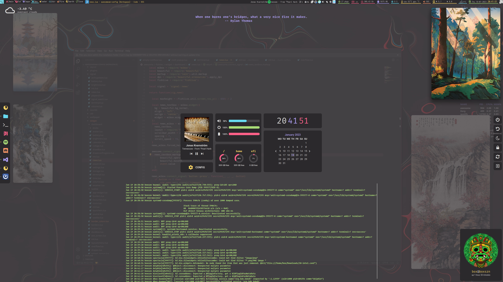
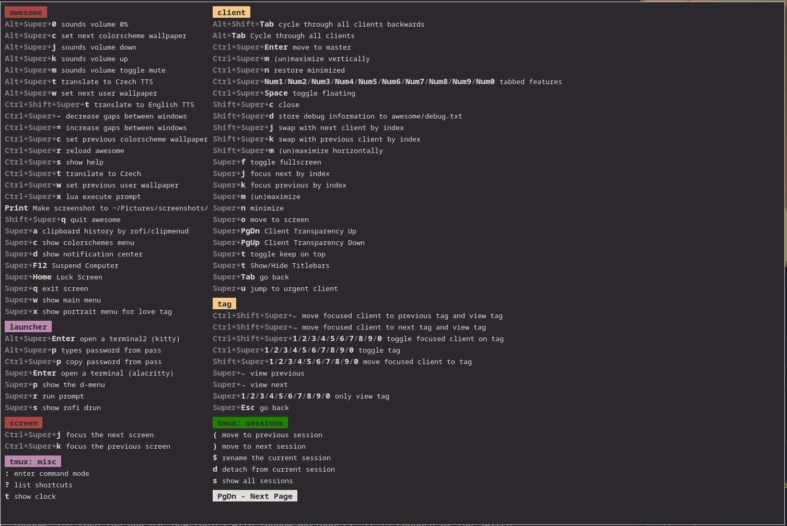
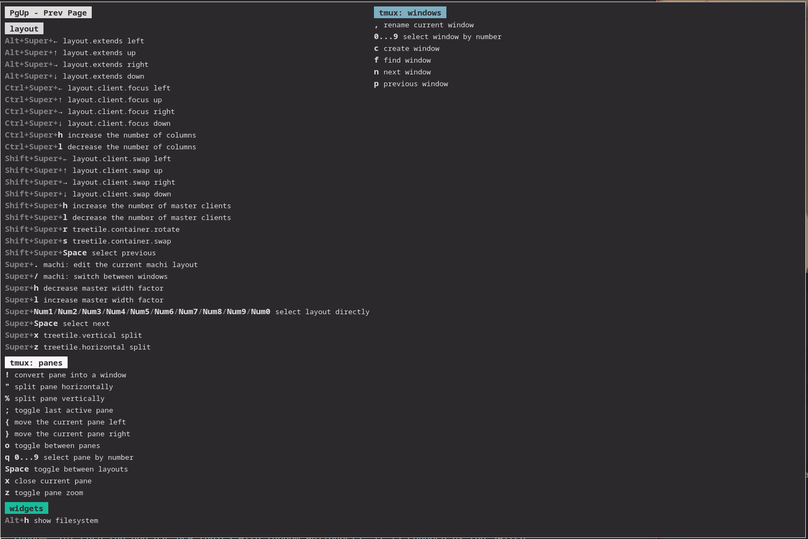
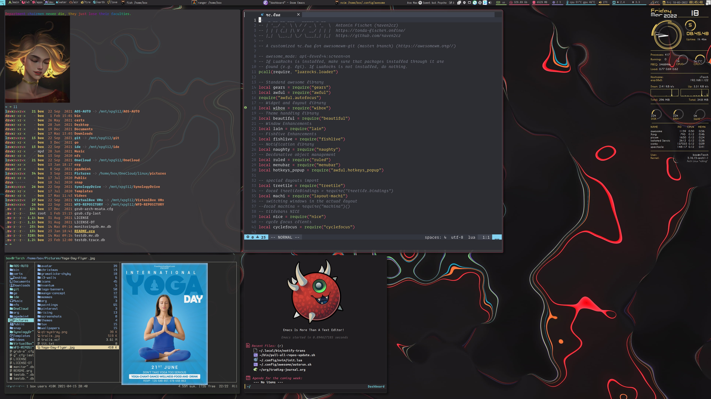
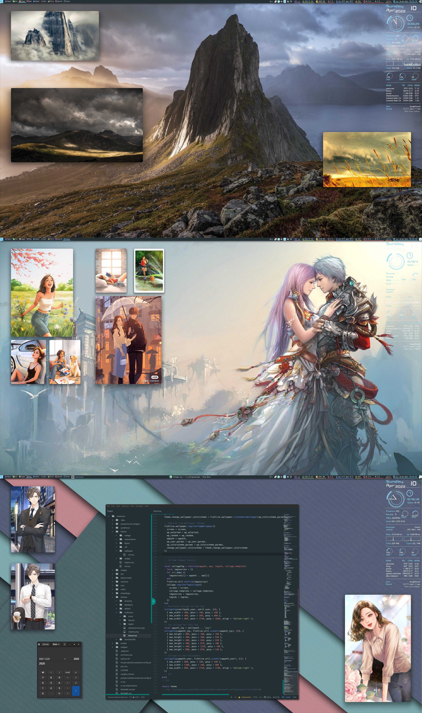
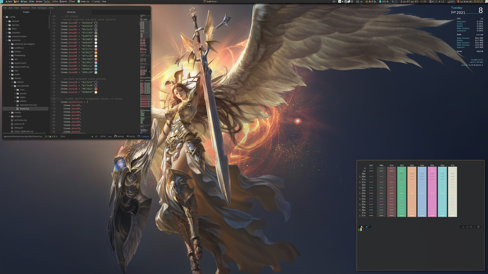
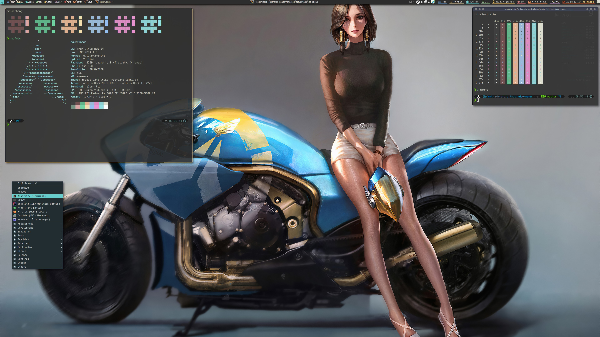
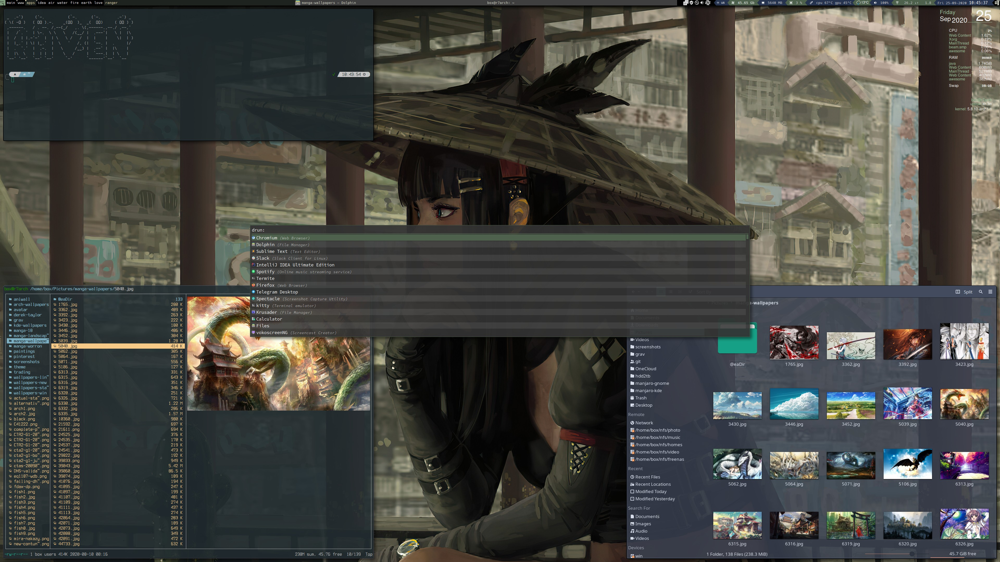
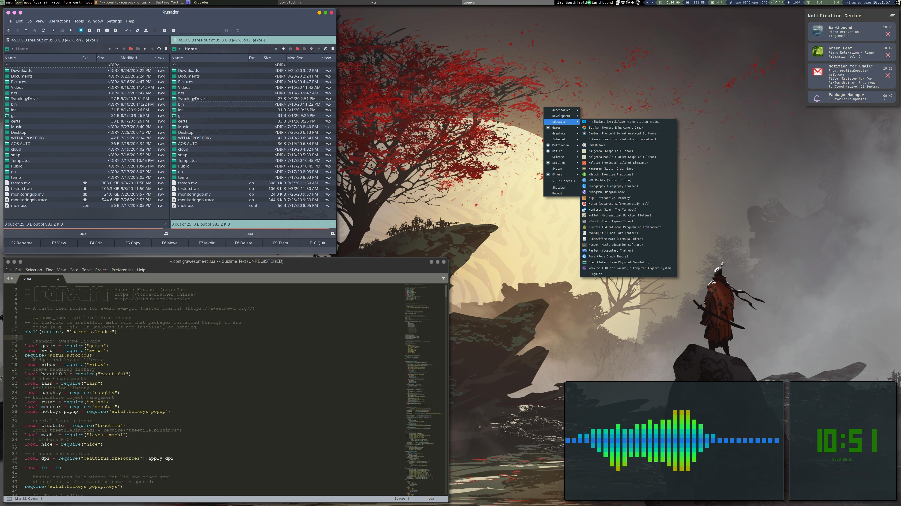
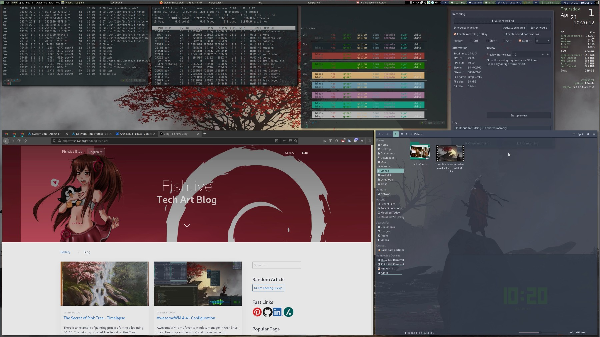

# Raven2cz's AwesomeWM Config


[](https://github.com/awesomeWM/awesome) [](LICENSE)

```
██████╗  █████╗ ██╗   ██╗███████╗███╗   ██╗  Antonin Fischer (raven2cz)
██╔══██╗██╔══██╗██║   ██║██╔════╝████╗  ██║  https://fishlive.org/
██████╔╝███████║██║   ██║█████╗  ██╔██╗ ██║  https://arch-linux.cz/
██╔══██╗██╔══██║╚██╗ ██╔╝██╔══╝  ██║╚██╗██║  https://github.com/raven2cz
██║  ██║██║  ██║ ╚████╔╝ ███████╗██║ ╚████║
╚═╝  ╚═╝╚═╝  ╚═╝  ╚═══╝  ╚══════╝╚═╝  ╚═══╝
```

Welcome to my AwesomeWM configuration files! This repository is a Git subtree mapped to the [raven2cz/dotfiles](https://github.com/raven2cz/dotfiles) project.

AwesomeWM is a highly configurable, next-generation framework window manager for X. It is very fast, extensible, and licensed under the **GNU GPLv2** license. It is primarily targeted at power users, developers, and any people dealing with everyday computing tasks who want to have fine-grained control over their graphical environment.
* AwesomeWM Trailer
[](https://youtu.be/4KKdbwZ8GQ4)

* Dashboard Component Trailer
[](https://youtu.be/9BOGT9Ufbe0)


## Table of Contents

- [Themes Configuration](#themes-configuration)
  - [Multicolor Theme](#multicolor-theme)
  - [80s OneDark Theme](#80s-onedark-theme)
  - [Amazing Theme](#amazing-theme)
- [Guide and Installation](#guide-and-installation)
- [Dependencies](#dependencies)
- [Features](#features)
- [New Features](#new-features)
- [Dashboard Component](#dashboard-component)
  - [Dashboard Dependencies](#dashboard-dependencies)
- [Keybindings Overview](#keybindings-overview)
- [Screenshots](#screenshots)
  - [Multicolor Theme](#multicolor-theme-screenshots)
  - [80s OneDark Theme](#80s-onedark-theme-screenshots)
  - [Amazing Theme](#amazing-theme-screenshots)
- [Videos](#videos)

## Themes Configuration

AwesomeWM [git-master] configuration with new **Multicolor Theme**, **80s OneDark Theme**, and **Amazing Theme**.

### Multicolor Theme

The Multicolor Theme brings 15 of the best color schemes today! It includes 13 dark and soft themes and 2 light themes. You can find schemes like `nord`, `doom_one`, `tomorrow_night`, `palenight`, `dracula`, `dark one`, etc. The system binds together special Lua scripts that change additional applications together: `kitty`, `alacritty`, and more planned. In the `public-wallpaper` packages, there are 50 prepared wallpapers dependent on the selected color scheme. An important change is notification support with portraits matching the appropriate color scheme and image collages.

All color schemes are applied on-the-fly without restarting the session; you just select the appropriate color scheme, and the entire WM, wallpapers, and other apps are changed. Wallpapers can be swapped for the appropriate color scheme by `super+alt+C` forward, `super+ctrl+C` backward, and the color scheme table is shown by `super+c`.

Tiling and Tab window support. Introduction is provided by YouTube video series and trailers; see links at the bottom of this article.

### 80s OneDark Theme

This theme focuses on Atom colors and 80s pastel color schemes. It includes a new complex configuration of the main panel with many features and additional modifications of conky, xmenu, rofi, and alacritty settings.

### Amazing Theme

The Amazing Theme focuses on green colors with gold highlights. Application styling and additional colors are based on Nordic Colors and the KDE Nordic Theme [An arctic, north-bluish color palette](https://www.nordtheme.com/).

## Guide and Installation

AwesomeWM walkthrough and installation instructions are part of the [Tux: Linux World Series](https://www.youtube.com/user/tondafischer/playlists). The series was primarily created for the Czech community. There were several requests from other communities for translation. AwesomeWM is part of translated episodes.

- [YouTube Series - Tux: Linux World Series](https://www.youtube.com/user/tondafischer/playlists) - Complete introduction to Arch Linux and GNU/Linux for newbies and advanced users.
- [Tux: Linux World Documentation](https://github.com/raven2cz/tux) - Documentation and step-by-step guides for the Tux Series.
- [AwesomeWM Basics](https://youtu.be/gPJQzUnSRxI) - Fundamental installation, default themes, and keybindings. Lua and main principles about AW.
- [AwesomeWM Ricins 1/2](https://youtu.be/gh6h9DvUJRI) - Advanced configuration and installation of the demo project Multicolor Theme. Architecture design and top-down guide.
- [AwesomeWM Demo Project and Keybindings](https://youtu.be/1dNNwsOx6hU) - Demonstration project with a full demo of advanced features and ergonomic keybindings for advanced users.

## Dependencies

- **AwesomeWM** git-master branch
- **picom** standard version (no blur)
- **Fonts**: Hack Nerd Font, Iosevka Nerd Font, Mononoki Nerd Font, TerminessTTF Nerd Font Mono
- **Git subtrees projects** included in `pull-git-subtrees-awesome-config.sh` script
- **Global-colorscheme** script from my GitHub repo: [raven2cz/global-colorscheme](https://github.com/raven2cz/global-colorscheme)
- **Public wallpapers** are in GitHub repo: [raven2cz/public-wallpapers](https://github.com/raven2cz/public-wallpapers)
- **Rofi themes** in GitHub repo: [raven2cz/rofi-themes](https://github.com/raven2cz/rofi-themes)

These dependencies are automatically checked out with this project:

```bash
#!/bin/bash
git subtree pull --prefix awesome-wm-widgets git@github.com:streetturtle/awesome-wm-widgets.git master --squash
git subtree pull --prefix cyclefocus git@github.com:blueyed/awesome-cyclefocus.git master --squash
git subtree pull --prefix lain git@github.com:lcpz/lain.git master --squash
git subtree pull --prefix layout-machi git@github.com:xinhaoyuan/layout-machi.git master --squash
git subtree pull --prefix machina git@github.com:basaran/awesomewm-machina.git master --squash
git subtree pull --prefix nice git@github.com:mut-ex/awesome-wm-nice.git master --squash
git subtree pull --prefix sharedtags git@github.com:Drauthius/awesome-sharedtags.git v4.0 --squash
```

## Features

- **Treetile layout (fixed)** from [alfunx/awesome-treetile](https://github.com/alfunx/awesome-treetile) - Thanks Alfunx for your fixes!
- **Machi layout** from [xinhaoyuan/layout-machi](https://github.com/xinhaoyuan/layout-machi) - Thanks Xinhaoyuan for the great layout!
- **Lain layouts and basic widgets** from [lcpz/lain](https://github.com/lcpz/lain) - Standard is still good 😃
- **awesome-wm-widgets** from [streetturtle/awesome-wm-widgets](https://github.com/streetturtle/awesome-wm-widgets) (weather, Spotify used)
- **Shell Color Scripts** and many advices from Derek Taylor [Shell Color Scripts](https://gitlab.com/dwt1/shell-color-scripts) - Derek, your YouTube channel is awesome, thanks a lot!
- **New widgets for Ryzen processors and AMD Radeon graphics cards temperatures** (added to the Lain widget folder)
- **Change wallpapers for the last active tag** (if more tags selected, the last ID is taken)
- **Random selection wallpaper for N.tag** - possibility to use the word "random" for each tag and use new tables with random wallpapers. It changes by tag switch.
- Sophisticated keybindings for extension of Lain and Machi layouts. Many keybinding tricks for quick work. See keybindings help.
- **Configured notification center** - notifications are configured and linked. In the current case, the history is stored to the `naughty_history` file.
- **Notification center component** - notification center Lua component added according to the original code creator: [JavaCafe01/dotfiles](https://github.com/JavaCafe01/dotfiles) - Your style is great. Notify center is the best!
- **Nice Titlebars component** - Wonderful titlebar component with many features added. Creator: [mut-ex/awesome-wm-nice](https://github.com/mut-ex/awesome-wm-nice)
- **i3lock-blur** for locking and suspending sessions.
- Optimized for HiDPI (4K) monitors.
- Dynamic color schemes changes (15 best color schemes supported)
- Notification portraits
- User, color scheme swap wallpapers
- **rofi-themes** - support dynamic change for all implemented color schemes (see link to rofi-themes in the dependencies section)
- **bling** - supports for tab views similar to i3 tabbing support
- **Image collage feature** - integrate image collages to each tag as part of the wallpaper with dynamic toggling images
- **Dashboard component** - complete ontop dashboard with many wiboxes: disks, news, terminal, player, controls, calendar, tasklist, etc.
- **Mebox** - powerful menu component - Kosorin creates a very powerful menu framework. I temporarily adopted his solution, waiting for his official library. Source: [kosorin/awesome-rice](https://github.com/kosorin/awesome-rice)

## New Features

- **Complete integration of multi-monitor support** based on `awesomewm-sharedtags`. All components of this project now support dynamic layout settings and different monitor resolutions.
- **Robust support for portrait layouts** in multi-monitor setups, accommodating monitors rotated by 90 degrees, which require different AwesomeWM layouts, wallpapers, collage arrangements, etc. This allows for completely separate configuration of portrait wallpapers for tags displayed in portrait mode.
- **Automatic switching between Full HD and HiDPI modes**; the number and usage of components on the top panel adapt accordingly.
- **Introduction of a simple yet effective component framework** that supports dynamic creation of components based on defined scopes, such as theme changes or multi-monitor setups. Simply include your component in the framework, and the factory method will handle the configuration and prepare the correct instance for immediate use where needed.
- **Rewriting of major graphical components** to leverage the new component framework, significantly simplifying and generalizing the code. Strong support for multi-monitor setups and theme changes has been added.
- **New controls for multi-monitor configurations** have been added. Collages and Tag Wallpapers have been improved. New display capabilities for the Dashboard and Exit Screen.
- **Addition of the main control script `dotfiles/bin/display-config-switcher`**, in addition to modifications in `raven2cz/awesomewm-config`. This script allows easy definition of desired display layouts, which the AwesomeWM project can recognize. This makes it simple to set up "display sessions" for all your desktops and laptops and switch between them according to your current preferences, even if you don't want to use a connected monitor at the moment. A variety of different options that I use daily are already defined.
- **Picom-git origin**: Enhanced support for new animations designed to avoid slowing down the computer while providing visual cues in situations where it might not be clear which window has changed or been maximized. The animations improve user orientation without impacting performance. This involves a completely new configuration in `dotfiles/.config/picom`, which must be integrated with settings in the AwesomeWM project to ensure proper cooperation.

## Dashboard Component

A dashboard component for AwesomeWM is a collection of wiboxes, which are panels that can be used to display various information and controls. These wiboxes include:

- **Time Wibox**: Displays the current time in a digital format, with options to switch between minutes and seconds processing.
- **Calendar Wibox**: Displays a calendar for the current month, with navigation to different months and viewing schedules (upcoming feature).
- **Controls Wibox**: Includes buttons or widgets for controlling various aspects of the system, such as volume, brightness, and power.
- **Player Wibox**: Displays the currently playing song and provides controls for playing, pausing, and skipping songs.
- **Tasklist Wibox**: Displays a list of currently running applications and allows users to switch between them, add favorite applications and icons.
- **Terminal Wibox**: Includes a terminal emulator that allows users to interact with the command line and ChatGPT.
- **News Wibox**: Shows actual news; the current implementation shows just fortune news.
- **Collage Wibox**: Beautiful preview of images in a defined folder, theme folder, or selected folder.
- **Right Panel Wibox**: For exit control commands.
- **And many others**.

Each of these wiboxes can be customized with different colors, fonts, and layouts, fully supporting **Multicolor Theme Changes**, to create a cohesive and visually pleasing dashboard. Additionally, the dashboard component includes the ability to toggle the visibility of some wiboxes. Support for HiDPI resolutions.

### Dashboard Dependencies

By default, the dashboard is activated with the shortcut `mod+z`; exit with `Esc` or click on the `HOST/PC panel` at the right-bottom corner. All user system configuration is included in a central file `config.lua`. Feature activity is a parameter `config.dashboard_enabled`.

```bash
paru -S acpi brightnessctl playerctl
```

## Keybindings Overview




## Screenshots

### Multicolor Theme Screenshots





### 80s OneDark Theme Screenshots




### Amazing Theme Screenshots




## Videos

See AwesomeWM in action:

[](https://youtu.be/-Fo7mB6_Wtg)

[](https://youtu.be/1nyB85CiJUc)

[](https://youtu.be/SNJOeR7mxCI)

[](https://youtu.be/QgjHP6Ju56k)

[](https://www.youtube.com/watch?v=YwvnJqN5s90)

[](https://youtu.be/Z0muY_lfFZU)
