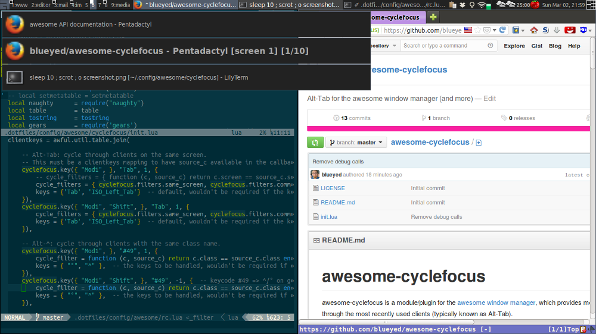

<!-- START doctoc generated TOC please keep comment here to allow auto update -->
<!-- DON'T EDIT THIS SECTION, INSTEAD RE-RUN doctoc TO UPDATE -->
**Table of Contents**  *generated with [DocToc](http://doctoc.herokuapp.com/)*

- [awesome-cyclefocus](#awesome-cyclefocus)
  - [Screenshot](#screenshot)
  - [Installation](#installation)
  - [Keybindings](#keybindings)
    - [Example 1: cycle through all windows](#example-1-cycle-through-all-windows)
    - [Example 2: cycle through windows on the same screen and tag](#example-2-cycle-through-windows-on-the-same-screen-and-tag)
      - [`cycle_filters`](#cycle_filters)
      - [Predefined filters](#predefined-filters)
    - [Example 3: cycle through clients with the same class](#example-3-cycle-through-clients-with-the-same-class)
  - [Reference](#reference)
    - [Configuration](#configuration)
      - [<a name="settings"></a>Settings](#a-namesettingsasettings)
  - [Status](#status)
- [Bugs, Feedback and Support](#bugs-feedback-and-support)
  - [Donate](#donate)

<!-- END doctoc generated TOC please keep comment here to allow auto update -->

# awesome-cyclefocus

awesome-cyclefocus is a module/plugin for the [awesome window
manager][], which provides methods to cycle through
the most recently used clients (typically known as Alt-Tab).

It allows to easily filter the list of windows to be cycled through, e.g. by
screen, tags, window class, name/title etc.

## Screenshot



Please note that the graphical aspect needs to be developed, but since people
like screenshots…

## Installation

*Requirements:* awesome-cyclefocus requires Awesome 4+.

Create a subdirectory `cyclefocus` in your awesome config directory, e.g.

    cd ~/.config/awesome
    git clone https://github.com/blueyed/awesome-cyclefocus cyclefocus

Then include it from your config file (`~/.config/awesome/rc.lua`), somewhere
at the beginning:

```lua
local cyclefocus = require('cyclefocus')
```

## Keybindings

Then you can define the keybindings.

While you can use it with the `globalkeys` configuration, you should use
the `clientkeys` table for any bindings which use `cycle_filters`.

The default for `modkey+Tab` in awesome (3.5.2) is:
```lua
awful.key({ modkey,           }, "Tab",
    function ()
        awful.client.focus.history.previous()
        if client.focus then
            client.focus:raise()
        end
    end),
```
You should disable it (e.g. by commenting it out), and add your method below.

Here are three methods to setup the key mappings:

### Example 1: cycle through all windows

Setup `modkey+Tab` to cycle through all windows (assuming `modkey` is
`Mod4`/`Super_L`, which is the default):

```lua
-- modkey+Tab: cycle through all clients.
awful.key({ modkey }, "Tab", function(c)
    cyclefocus.cycle({modifier="Super_L"})
end),
-- modkey+Shift+Tab: backwards
awful.key({ modkey, "Shift" }, "Tab", function(c)
    cyclefocus.cycle({modifier="Super_L"})
end),
```

You can pass a table of optional arguments.
We need to pass the modifier (as seen by awesome's `keygrabber`) here.
Internally the direction gets set according to if the `Shift` modifier key
is present, so that the second definition is only necessary to trigger it in
the opposite direction from the beginning.

See the `init.lua` file (or the [settings section below](#settings)) for a full
reference.

### Example 2: cycle through windows on the same screen and tag

You can use `cyclefocus.key` (a wrapper around `awful.key`) like this:

```lua
-- Alt-Tab: cycle through clients on the same screen.
-- This must be a clientkeys mapping to have source_c available in the callback.
cyclefocus.key({ "Mod1", }, "Tab", {
    -- cycle_filters as a function callback:
    -- cycle_filters = { function (c, source_c) return c.screen == source_c.screen end },

    -- cycle_filters from the default filters:
    cycle_filters = { cyclefocus.filters.same_screen, cyclefocus.filters.common_tag },
    keys = {'Tab', 'ISO_Left_Tab'}  -- default, could be left out
}),
```

The first two arguments are the same as with `awful.key`: a list of modifiers
and the key. Then the table with optional arguments to `cyclefocus.cycle()`
follows.
(here the `modifier` argument is not required, because it gets used from
the first argument).

NOTE: this needs to go into `clientkeys`.

#### `cycle_filters`

In this case the `cycle_filters` argument is used, which is a list of filters
to apply while cycling through the focus history: it gets passed a `client`
object, and optionally another `client` object for the source (where the
cycling started).
For the source client to be available, it needs to be an entry in the
`clientkeys` table.

You can pass functions here, or use one of the predefined filters:

#### Predefined filters

The following filters are available by default:

```lua
-- A set of default filters, which can be used for cyclefocus.cycle_filters.
cyclefocus.filters = {
    -- Filter clients on the same screen.
    same_screen = function (c, source_c) return c.screen == source_c.screen end,

    same_class = function (c, source_c)
        return c.class == source_c.class
    end,

    -- Only marked clients (via awful.client.mark and .unmark).
    marked = function (c, source_c)
        return awful.client.ismarked(c)
    end,

    common_tag  = function (c, source_c)
        for _, t in pairs(c:tags()) do
            for _, t2 in pairs(source_c:tags()) do
                if t == t2 then
                    cyclefocus.debug("Filter: client shares tag '" .. t.name .. " with " .. c.name)
                    return true
                end
            end
        end
        return false
    end
}
```

### Example 3: cycle through clients with the same class

The following will cycle through windows, which share the same window class
(e.g. only Firefox windows, when starting from a Firefox window):

```lua
-- Alt-^: cycle through clients with the same class name.
cyclefocus.key({ "Mod1", }, "#49", 1, {
        cycle_filter = function (c, source_c) return c.class == source_c.class end,
        keys = { "°", "^" },  -- the keys to be handled, wouldn't be required if the keycode was available in keygrabber.
}),
cyclefocus.key({ "Mod1", "Shift", }, "#49", -1, {  -- keycode #49 => ^/° on german keyboard, upper left below Escape and next to 1.
        cycle_filter = function (c, source_c) return c.class == source_c.class end,
        keys = { "°", "^" },  -- the keys to be handled, wouldn't be required if the keycode was available in keygrabber.
}),
```

The key argument uses the keycode notation (`#49`) and refers (probably) to the key
below Escape, above Tab and next to the first digit (1).
It should be the same shortcut, as what Ubuntu's Unity uses to cycle through
the windows of a single application.

NOTE: You need to pass the keys this refers to via the `keys` argument, so that
the keygrabber considers those only.
In the example above, `^` and `°` refers to the key on the German keyboard
layout (un-shifted and shifted, i.e. with Shift pressed and released).

NOTE: this needs to go into `clientkeys`.

## Reference

### Configuration

awesome-cyclefocus can be configured by passing optional arguments to the
`cyclefocus.cycle` or `cyclefocus.key` functions, or by setting defaults, after
loading `cyclefocus`:

#### <a name="settings"></a>Settings

The default settings are:

```lua
cyclefocus = {
    -- Should clients get shown during cycling?
    -- This should be a function (or `false` to disable showing clients), which
    -- receives a client object, and can make use of `cyclefocus.show_client`
    -- (the default implementation).
    show_clients = true,
    -- Should clients get focused during cycling?
    -- This is required for the tasklist to highlight the selected entry.
    focus_clients = true,
    -- Should the selected client get raised?
    -- This calls `cyclefocus.raise_client_without_focus` by default, which you
    -- can use when overriding this with a function (that gets the client as
    -- argument).
    raise_client = true,
    -- Should the mouse pointer be moved away during cycling?
    -- This is normally done to avoid interference from sloppy focus handling,
    -- but can be disabled if you do not use sloppy focus.
    move_mouse_pointer = true,

    -- How many entries should get displayed before and after the current one?
    display_next_count = 3,
    display_prev_count = 3,

    -- Default preset to use for entries.
    -- `preset_for_offset` (below) gets added to it.
    default_preset = {},

    --- Templates for entries in the list.
    -- The following arguments get passed to a callback:
    --  - client: the current client object.
    --  - idx: index number of current entry in clients list.
    --  - displayed_list: the list of entries in the list, possibly filtered.
    preset_for_offset = {
        -- Default callback, which will gets applied for all offsets (first).
        default = function (preset, args)
            -- Default font and icon size (gets overwritten for current/0 index).
            preset.font = 'sans 8'
            preset.icon_size = dpi(24)
            preset.text = escape_markup(cyclefocus.get_client_title(args.client, false))
        end,

        -- Preset for current entry.
        ["0"] = function (preset, args)
            preset.font = 'sans 14'
            preset.icon_size = dpi(36)
            preset.text = escape_markup(cyclefocus.get_client_title(args.client, true))
            -- Add screen number if there is more than one.
            if screen.count() > 1 then
                preset.text = preset.text .. " [screen " .. tostring(args.client.screen.index) .. "]"
            end
            preset.text = preset.text .. " [#" .. args.idx .. "] "
            preset.text = '<b>' .. preset.text .. '</b>'
        end,

        -- You can refer to entries by their offset.
        -- ["-1"] = function (preset, args)
        --     -- preset.icon_size = 32
        -- end,
        -- ["1"] = function (preset, args)
        --     -- preset.icon_size = 32
        -- end
    },

    -- Default builtin filters.
    -- (meant to get applied always, but you could override them)
    cycle_filters = {
        function(c, source_c) return not c.minimized end,  --luacheck: no unused args
    },

    -- Experimental: Width of icon column ("max_icon_size", used for margin).
    -- This could be "margin" etc instead, but currently only the width for the
    -- current entry is known.
    icon_col_width = dpi(36),

    -- EXPERIMENTAL: only add clients to the history that have been focused by
    -- cyclefocus.
    -- This allows to switch clients using other methods, but those are then
    -- not added to cyclefocus' internal history.
    -- The get_next_client function will then first consider the most recent
    -- entry in the history stack, if it's not focused currently.
    --
    -- You can use cyclefocus.history.add to manually add an entry, or
    -- cyclefocus.history.append if you want to add it to the end of the stack.
    -- This might be useful in a request::activate signal handler.
    -- only_add_internal_focus_changes_to_history = true,

    -- The filter to ignore clients altogether (get not added to the history stack).
    -- This is different from the cycle_filters.
    -- The function should return true / the client if it's ok, nil otherwise.
    filter_focus_history = awful.client.focus.filter,

    -- Display notifications while cycling?
    -- WARNING: without raise_clients this will not make sense probably!
    display_notifications = true,

    -- Debugging: messages get printed, and should show up in ~/.xsession-errors etc.
    -- 1: enable, 2: verbose, 3: very verbose, 4: much verbose.
    debug_level = 0,
    -- Use naughty notifications for debugging (additional to printing)?
    debug_use_naughty_notify = false,
}
```

You can change them like this:
```lua
cyclefocus = require("cyclefocus")
cyclefocus.debug_level = 2
```

You can also use custom settings when calling `cyclefocus.cycle` or
`cyclefocus.key` via `args`, e.g. to not display notifications when switching
between clients on the same tag:
```lua
cyclefocus.key({ modkey, }, "Tab", 1, {
    cycle_filters = { cyclefocus.filters.common_tag },
    display_notifications = false,
    modifier='Super_L', keys={'Tab', 'ISO_Left_Tab'}
}),
cyclefocus.key({ modkey, "Shift", }, "Tab", 1, {
    cycle_filters = { cyclefocus.filters.common_tag },
    display_notifications = false,
    modifier='Super_L', keys={'Tab', 'ISO_Left_Tab'}
}),
```

## Status

Stable: it works well for me and others.
Internals, default settings and behavior might still change.

I came up with this while dipping my toes in the waters of awesome. If you have
problems, please enable `cyclefocus.debug_level` (goes up to 3) and report your
findings on the [Github issue tracker][].

# Bugs, Feedback and Support

You can report bugs and wishes at the [Github issue tracker][].

Pull requests would be awesome! :)

## Donate

[](https://flattr.com/submit/auto?user_id=blueyed&url=https://github.com/blueyed/awesome-cyclefocus&title=awesome-cyclefocus&language=en&tags=github&category=software)

Bitcoin: 16EVhEpXxfNiT93qT2uxo4DsZSHzNdysSp

[awesome window manager]: http://awesome.naquadah.org/
[Github issue tracker]: https://github.com/blueyed/awesome-cyclefocus/issues
